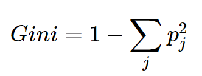
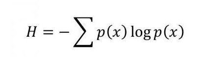
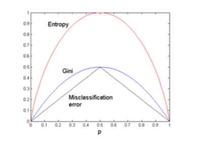

# Decision Trees
Decision tree builds classification or regression models in the form of a tree structure. It breaks down a dataset into smaller subsets with increase in depth of tree.

The first glance of implementing this was... there are a lot of different approaches, how to start?

## Decision Tree Types

A Tree construction is a NP-Hard problem (generally solved by a greedy algorithm, this could result in a local optimal solution). This are the three mos known solutions for Decision Trees:

### ID3 (Iterative Dichotomiser 3) by Ross Quinlan 1986

ID3 uses Entropy and Information Gain to construct a decision tree.
Find for each node the categorical feature that will yield the largest information gain for categorical targets.

Trees are grown to their maximum size and then a pruning step is usually applied to improve the ability of the tree to generalize to unseen data.

* Only for Classification
* Top Down
* Greedy approach
* Multiway tree
* Categorical Features only

### C4.5 (why C?), Ross Quinlan again

The successor to ID3, allow numerical features by defining a discrete attribute (based on numerical variables) that partitions the continuous attribute value into a discrete set of intervals.

* Only for Classification
* Top-down
* Greedy approach (no backtracking)
* Multiway tree
* Categorical and Numerical Features
* Handles incomplete data points
* Pruning (tries to solve over-fitting problem)
* Converts the trained trees into sets of **if-then rules**.

> Meaning of C? maybe it was because originally implemented in C language

### CART (Classification and Regression Trees), Breiman in 1984

It constructs **binary trees** using the features and thresholds that yields the largest information gain at each node.

* Classification and Regression
* Top-down
* Greedy approach (no backtracking)
* Binary trees
* Categorical and Numerical Features
* Do not outputs if-then rules

## Fundamental Concepts 

### Inpurity Measures

Impurity Measures are used to find the equality or randomness of the dataset when it is split into the nodes.

#### Gini
Easier to understand, it's the “measure how often a randomly chosen element from the set would be incorrectly labeled”

#### Entropy
It's used in ID3, C4.5 and similar.
Calculated the homogeneus of

#### Misclassification Error

### Advantages of CART

* Simple to understand, interpret, visualize.
* Decision trees implicitly perform variable screening or feature selection.
* Can handle both numerical and categorical data. Can also handle * multi-output problems.
* Decision trees require relatively little effort from users for data preparation.
* Nonlinear relationships between parameters do not affect tree performance.

### Disadvantages of CART

* Decision-tree learners can create over-complex trees that do not generalize the data well. This is called overfitting.
* Decision trees can be unstable because small variations in the data might result in a completely different tree being generated. This is called variance, which needs to be lowered by methods like bagging and boosting.
* Greedy algorithms cannot guarantee to return the globally optimal decision tree. This can be mitigated by training multiple trees, where the features and samples are randomly sampled with replacement.
* Decision tree learners create biased trees if some classes dominate. It is therefore recommended to balance the data set prior to fitting with the decision tree.

## References

[Tree algorithms: ID3, C4.5, C5.0 and CART](https://medium.com/datadriveninvestor/tree-algorithms-id3-c4-5-c5-0-and-cart-413387342164)