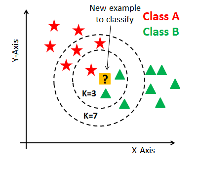

# K Nearest Neighbours (KNN)

K Nearest neighbors is one one the simplest predictive models. It seems more like a data mining algorithm than a machine learning model.

It only requires a concept of distance and Mode. An assumption that points that are close to another are similar.

This algorithm works as follows:

1. Compute all distances from the new instance to the examples.
2. Order the labeled examples by increasing distance.
3. Find a heuristically optimal number k of nearest neighbors, based on RMSE. This is done using cross validation.
4. Calculate the majority vote or calculate an inverse distance weighted average with the k-nearest multivariate neighbors.

### Advantages
* Non-parametric
* Simple and easy to understand
* Don't need time to train (instance based learning or lazy learning)

### Disavantages
* Don't scale with large datasets
* Doesn't work with high dimentions
* Sensitive to noise data
* Depends on the value of K
* Feature scaling is a must
