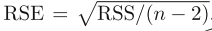

# Linear Regression

To simplify, Linear Regression is simply a weighted sum of inputs plus a constant:

## Simple Linear Regression

Creating a simple one dimentional function of a linear relation between X and y:

 

### Minimize the residual sum of Squares

The residual sum of squares (RSS) is:

 
Using the e in i position represents the ith residual. The RSS is:

### Using Derivatives

Using derivatives to minimize the RSS

we end up with this formula:

And, that it! we now can use the Betha1 as the slope and the Betha0 as the intercept.

### Analysing the residuals

How accurate is the sample mean ˆμ as an estimate of μ?

By calculate the standard error of each parameter Betha0 and Betha1 :

The Sigma is the standard error of the residuals (or residual standard error RSE) Y - ^Y and can be retrieved by this formula:

### Residuals Assumptions

The error term or residuals assume to be:

* Normally distributed
* Homoscedastic (same variance for every X)
* Independent

## Multiple Linear Regression
Simple linear regression is a useful approach for predicting a response on the basis of a single predictor variable. However, in practice we often have more than one predictor.

The multiple regression coefficient estimates have somewhat complicated forms that are most easily represented using matrix algebra. 

Again we're trying to minimize the RSS:

 

Applying the parcial derivatives:

 

The array with all the Coeficients is given by:

### Comments
The Normal Equation may not work if the matrix X^T * X is not invertible (i.e., singular), such as if m < n or if some features are redundant, but the pseudoinverse is always defined.

## Gradient Descendent

The general idea of Gradient Descent is to tweak parameters iteratively in order to minimize a cost function.

The MSE cost function for a Linear Regression model happens to be a convex function, which means that if you pick any two points on the curve, the line segment joining them never crosses the curve. This implies that there are no local minima, just one global minimum.

When using Gradient Descent, you should ensure that all features have a similar scale, otherwise it will take a long time to converge.

## References

[Hastie, T., Tibshirani, R., & Friedman, J. (2009). The Elements of Statistical Learning. ](https://doi.org/10.1007/b94608_4)

[Regression & Correlation for Military Promotion: A Tutorial](https://www.kdnuggets.com/2016/04/regression-correlation-military-tutorial.html/2)
