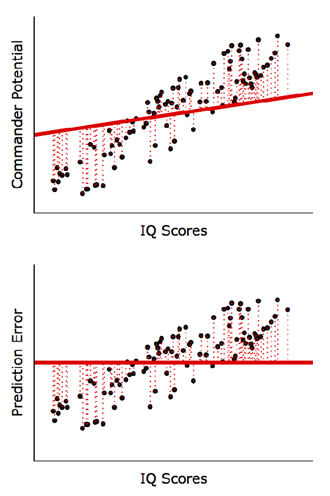
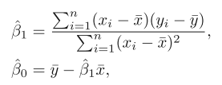
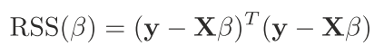

# Linear Regression

To simplify, Linear Regression is simply a weighted sum of inputs plus a constant:

## Simple Linear Regression

Creating a simple one dimentional function of a linear relation between X and y:

 

### Minimize the residual sum of Squares

The residual sum of squares (RSS) is:

 
Using the e in i position represents the ith residual. The RSS is:

### Using Derivatives

Using derivatives to minimize the RSS

we end up with this formula:

And, that it! we now can use the Betha1 as the slope and the Betha0 as the intercept.

### Analysing the residuals

How accurate is the sample mean ˆμ as an estimate of μ?

By calculate the standard error of each parameter Betha0 and Betha1 :

The Sigma is the standard error of the residuals (or residual standard error RSE) Y - ^Y and can be retrieved by this formula:

### Residuals Assumptions

The error term or residuals assume to be:

* Normally distributed
* Homoscedastic (same variance for every X)
* Independent

## Multiple Linear Regression
Simple linear regression is a useful approach for predicting a response on the basis of a single predictor variable. However, in practice we often have more than one predictor.

The multiple regression coefficient estimates have somewhat complicated forms that are most easily represented using matrix algebra. 

Again we're trying to minimize the RSS:

 

Applying the parcial derivatives:

 

The array with all the Coeficients is given by:

### Comments
The Normal Equation may not work if the matrix X^T * X is not invertible (i.e., singular), such as if m < n or if some features are redundant, but the pseudoinverse is always defined.

## Gradient Descent

The general idea of Gradient Descent is to tweak parameters iteratively in order to minimize a cost function.

 

The MSE cost function for a Linear Regression model happens to be a convex function, which means that if you pick any two points on the curve, the line segment joining them never crosses the curve. This implies that there are no local minima, just one global minimum.

### Learning Rate
An important parameter in Gradient Descent is the size of the steps, determined by the learning rate hyperparameter. If the learning rate is too small, then the algorithm will have to go through many iterations to converge, which will take a long time.

### Calculating the new Coeficients Interatively

 

There is three ways to perform the gradient descent:

* Batch: The formula involves calculations over the full training set X, at each Gradient Descent step.
It uses the whole batch of training data at every step. As a result it is terribly slow on very large training sets.

* Stochastic: It picks a random instance in the training set at every step and computes the gradients based only on that single instance. The cost function will bounce up and down but it will decreasing on average. Over time it will end up very close to the minimum.

* Mini Batch: At each step, instead of computing the gradients based on the full training set or based on just one instance, Mini batch computes the gradients on small random sets of instances.

### Comments 
When using Gradient Descent, you should ensure that all features have a similar scale, otherwise it will take a long time to converge.

## Bias and Variance Trade-off

The model generalization can be expressed as the sum of three different errors:

* Bias: Is how well the model is fitted to the training dataset. High bias is mostly a underfitting problem.
* Variance: It's related to how sensible the model is to new data (test or validation). High Variance is probably an overfitting issue.
* Irreducible Error: It's related to the intrinsic noisiness of the data. It can be reduced by data cleaning techniques.

 

Increasing a model’s complexity will typically increase its variance and reduce its bias. Conversely, reducing a model’s complexity increases its bias and reduces its variance. This is why it is called a tradeoff.

## Regularization

Regularization is a method to automatically penalizing extra features and avoid overfitting.
Both can be used with simple derivatives or gradient descendent.

 

### Lasso

New Cost Function:

 

* Adds a penalty to the cost function that is the sum of all modules of coeficients;
* It's also called L1 Regularization;
* The Coeficients can be set to zero, so  Lasso can work as a feature selection approach.
* when alpha is zero, the cost function is the same as the regular linear regression.

### Ridge

New Cost Function:

 

* The penalty is the sum of squared coeficients.
* It's also called L2 regularization;
* The coeficients are never set to zero but can be very close to.
* when alpha is zero, the cost function is the same as the regular linear regression.

### ElasticNet

New Cost Function:

 

* Is the mix of L1 and L2 regularization.
* The parameter ratio controls the weight of each regularizer method.

## Comments

* Lasso tend to give more sparse weights (most zeros). Lasso (and Elastic-net with ratio close to one) may be really good idea to start with because they can work as feature selection.

* Ridge tends to give small but well distributed weights. Try it if you have few features, they should be really relevant for predictions.

* You will need to scale your data before using these regularized linear regression methods. Use StandardScaler first, or set ‘normalize’ in these estimators to ‘True’.

## References

[Hastie, T., Tibshirani, R., & Friedman, J. (2009). The Elements of Statistical Learning. ](https://doi.org/10.1007/b94608_4)

[Boehmke, B., & Greenwell, B. (2019). Hands-On Machine Learning with Scikit-Learn, Keras & TensorFlow. In Hands-On Machine Learning with R.](https://doi.org/10.1201/9780367816377)

[Regression & Correlation for Military Promotion: A Tutorial](https://www.kdnuggets.com/2016/04/regression-correlation-military-tutorial.html/2)

[What’s the difference between Linear Regression, Lasso, Ridge, and ElasticNet in sklearn?](https://towardsdatascience.com/whats-the-difference-between-linear-regression-lasso-ridge-and-elasticnet-8f997c60cf29)